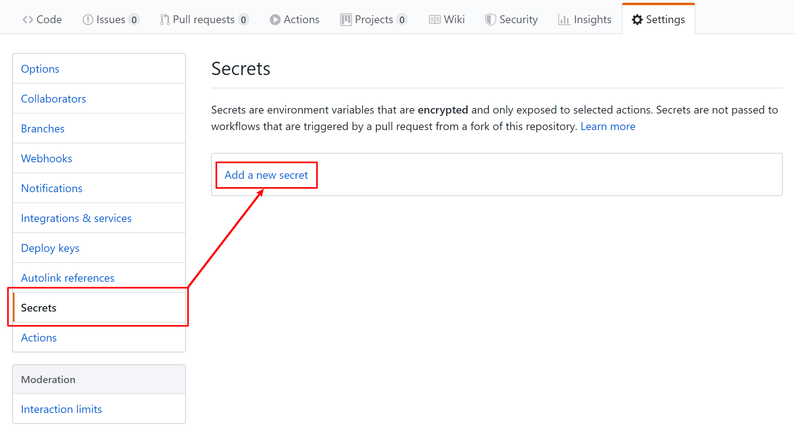
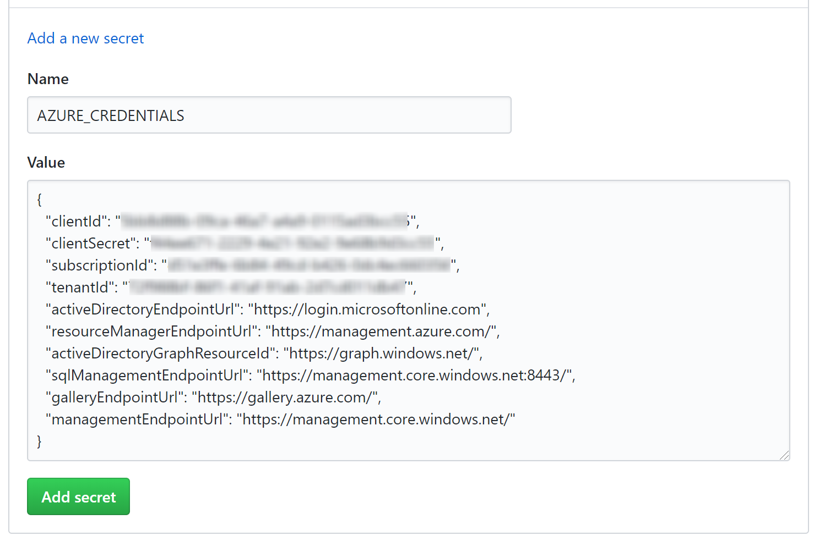

# GitHub Actions for Azure Spring Cloud Sample

This repository presents how to deploy Azure Spring Cloud by using GitHub Actions.

## How it works

Azure has officially released [GitHub Actions for Azure](https://github.com/Azure/actions/), including two actions, Azure login and Azure CLI.

This sample uses Azure login action to handle Azure authorization, and uses Azure CLI action to execute Azure Spring Cloud CLI.

## Prerequisite

You need Azure credential to authorize Azure login action. To get Azure credential, you need execute command below on you local machine:

```
az ad sp create-for-rbac --role contributor --scopes /subscriptions/<SUBSCRIPTION_ID> --sdk-auth
```

> * If you haven't installed Azure CLI locally, see <https://docs.microsoft.com/en-us/cli/azure/install-azure-cli?view=azure-cli-latest>.
>
> * If you haven't logged with Azure CLI, run `az login` before execute command above.

If you would like to access to specific resource group, you can reduce the scope:

```
az ad sp create-for-rbac --role contributor --scopes /subscriptions/<SUBSCRIPTION_ID>/resourceGroups/{RESOURCE_GROUP} --sdk-auth
```

For more details about how to manage Azure Active Directory service principals, see <https://docs.microsoft.com/en-us/cli/azure/ad/sp?view=azure-cli-latest#az-ad-sp-create-for-rbac>

The command should output a JSON object similar to this:

```json
{
    "clientId": "<GUID>",
    "clientSecret": "<GUID>",
    "subscriptionId": "<GUID>",
    "tenantId": "<GUID>",
    (...)
}
```

Save this JSON string, and set it as secret in GitHub in the later step.

## Write your workflow

Create a new repository in GitHub, create `.github/workflow/spring.yml` file in the repository, and paste code below:

> You should clone the repository to your local machine first, and create the file on your local machine. If you create this file on GitHub in browser, the action could run in error because you haven't set `secrets.AZURE_CREDENTIALS`. If you still would like to create the file online, see [**Re-run checks**](#re-run-checks) section to solve the error.

```yml
on: [push]

name: AzureSpringCloud

jobs:

  build-and-deploy:
    runs-on: ubuntu-latest
    steps:
    
    - name: Azure Login
      uses: azure/login@v1
      with:
        creds: ${{ secrets.AZURE_CREDENTIALS }}
    
    - name: Azure CLI script
      uses: azure/CLI@v1
      with:
        azcliversion: 2.0.75
        inlineScript: |
          az extension add --name spring-cloud
          az spring-cloud list
```

The last line is to execute `az spring-cloud list`, which list all spring cloud services in your subscriptions (if the credential scope you use is resource group, this command lists resources in the specific resource group).

You can change command in the last line to what you need. Such as creating app with `az spring-cloud app create`.

For full Azure Spring Cloud CLI reference, see <https://docs.microsoft.com/en-us/azure/spring-cloud/spring-cloud-cli-reference>

## Set Azure credential and enable GitHub Actions

Open GitHub repository page, and click **Settings** tab. Open **Secrets** menu, and click **Add a new secret**



Set the secret name to `AZURE_CREDENTIALS`, and its value to the JSON string which you get in [**Prerequisite**](#prerequisite) section.



GitHub Actions should be enabled automatically after you push `.github/workflow/spring.yml` to GitHub. If you create this file in the browser, your action should have already run.

To verify your action has been enabled, click **Actions** tab on GitHub repository page:


## Re-run checks

If your action runs in error, such as you haven't set Azure credential, you can re-run checks after fix the error.

On GitHub repository page, click **Actions**, select the specific workflow task, then click **Re-run checks** button to re-run checks:


## How to trigger GitHub Actions

By default, GitHub Actions run when you push a new commit. If you would like to trigger GitHub Actions without code change, you can push an empty commit to run your action:

```
git commit --allow-empty -m "Trigger GitHub Actions"
git push
```

This command may muck up your commit history though.